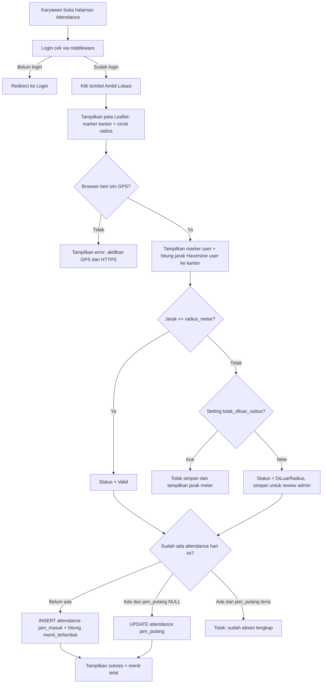
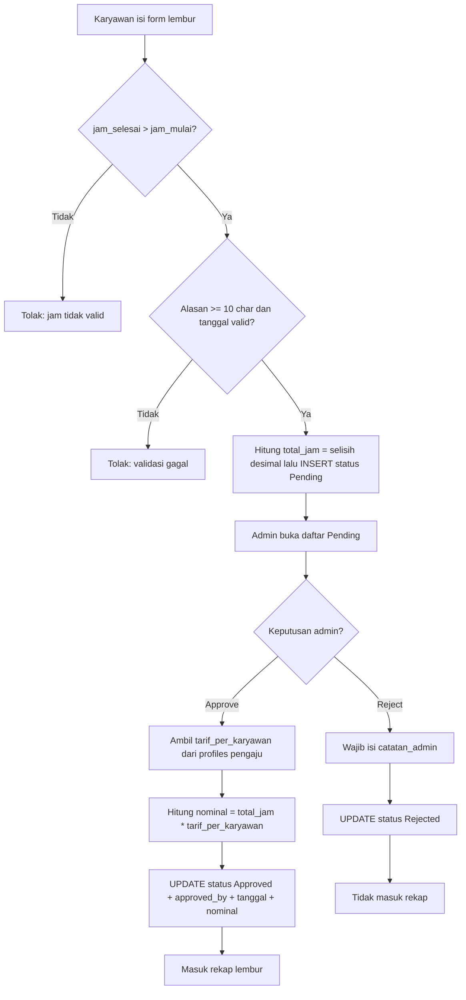
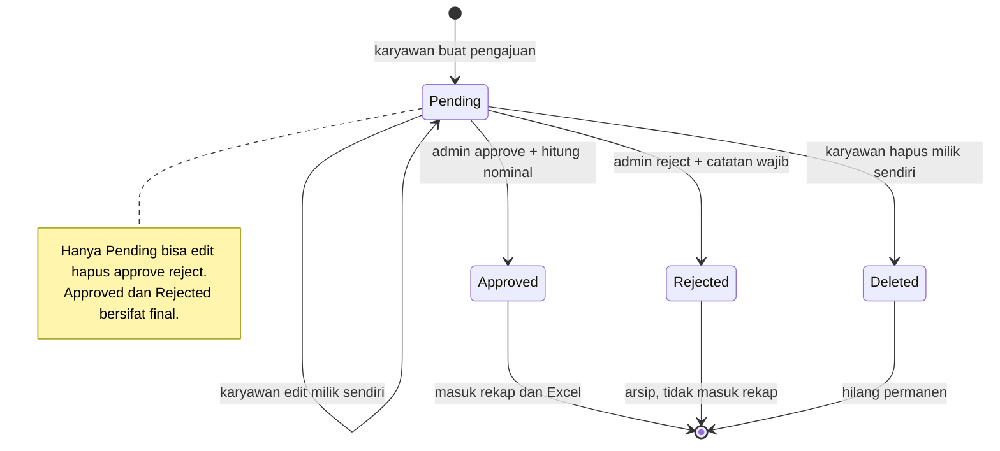
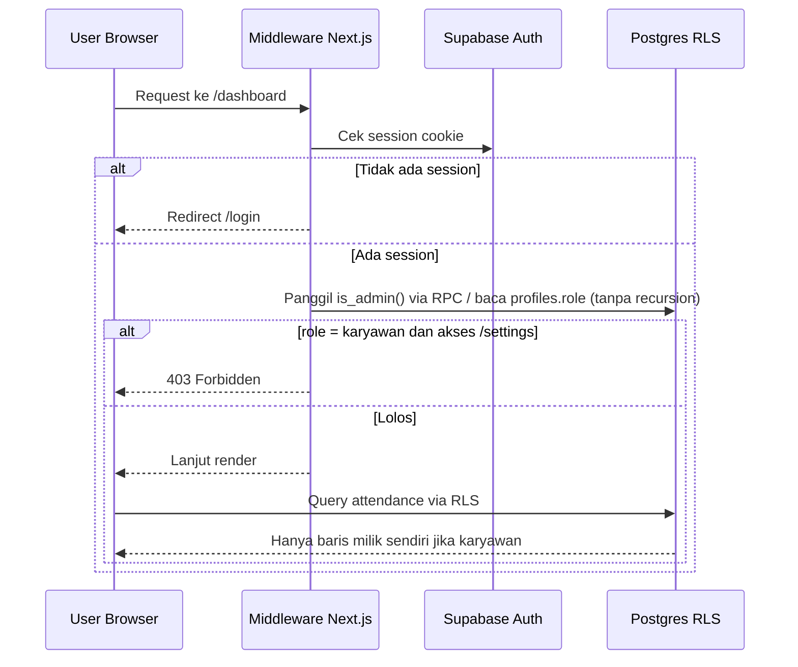
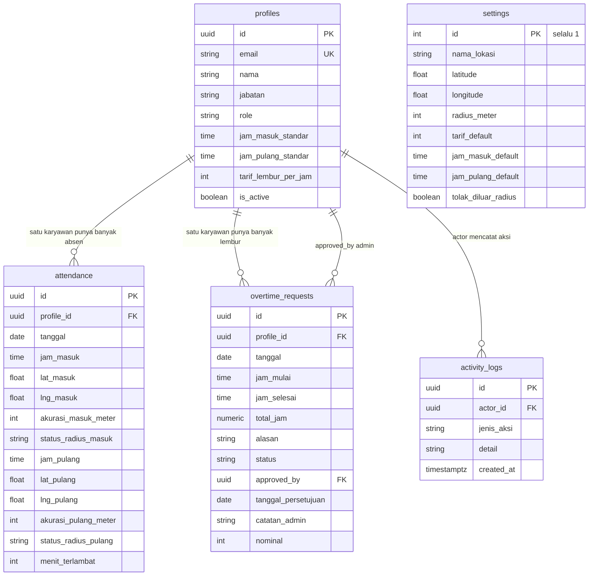
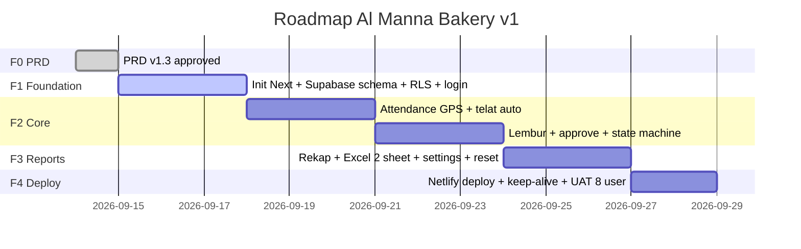

# PRD — Sistem Absensi Al Manna Bakery v1.3

## 0. Metadata

| Field | Nilai |
|-------|-------|
| Nama Proyek | Sistem Absensi Al Manna Bakery |
| Versi PRD | 1.4 (revisi: tarif denda keterlambatan + toleransi global, hapus karyawan, dashboard karyawan = rekap bulan berjalan, Rekap admin-only) |
| Tanggal | 2026-09-14 |
| Bahasa | Indonesia |
| Status | Approved untuk implementasi |
| Lokasi Output | `ABSEN-OPENCODE-MUSE-SPARK/PRD.md` |
| Jumlah Akun | 9 akun total = 8 karyawan + 1 admin (skala target: 1 - 50 karyawan) |
| Role | 2 role: `karyawan`, `admin` |
| Stack Tetap | Next.js 16 App Router + TypeScript + Tailwind v4 + Leaflet + react-leaflet + Supabase Free + Netlify Starter + exceljs |
| Catatan Versi | Terpasang Next.js 16.3.5 (bukan 15). Di v16: `middleware.ts` → `proxy.ts` (fungsi `proxy`), `next lint` dihapus (pakai `eslint`), Turbopack default, `cookies()`/`headers()` async. Tema tetap. |
| Titik Kantor Tetap | `-4.030128, 122.473738` (default `settings.latitude`, `settings.longitude`) |
| Radius Default | `100` meter, bisa diubah admin |
| Timezone Aplikasi | `Asia/Makassar` (WITA, UTC+8). Semua "hari ini" dihitung dengan timezone ini, bukan timezone server. |
| Data Karyawan | Dummy 9 akun untuk fase frontend (lihat bab 9.3) |
| Constraint | Free tier optimal, komersial-allowed, mobile-first, tanpa foto |

## 1. Ringkasan Eksekutif

- Masalah: rekap keterlambatan dan lembur masih manual. Sulit menentukan gaji yang adil berbasis jam kerja aktual.
- Solusi: aplikasi web absensi berbasis lokasi GPS + pengajuan lembur + rekap otomatis.
- Output utama: rekap total keterlambatan per karyawan (menit/jam) dan rekap total durasi lembur + nominal (Rp) per periode. Output dipakai admin untuk menentukan gaji.
- Tanpa foto/selfie. Validasi hanya radius GPS (Haversine). Akurasi GPS dicatat sebagai log saja, tidak memblokir absen.

## 2. Glosarium (Definisi Untuk AI)

| Istilah | Definisi |
|---------|----------|
| `profiles` | Tabel karyawan + admin. Satu baris = satu user. Berisi jam standar dan tarif lembur per karyawan. |
| `settings` | Tabel konfigurasi global. Hanya 1 baris `id=1`. Berisi lat, lng, radius, jam default, `tolak_diluar_radius`. Tidak ada tarif per karyawan. |
| `Tarif_Per_Karyawan` | Kolom `profiles.tarif_lembur_per_jam`. Beda tiap karyawan, diatur admin. Satuan Rp/jam. |
| `Tarif_Denda` | Kolom `profiles.tarif_denda_per_jam`. Tarif denda keterlambatan per karyawan. Satuan Rp/jam. Diatur admin di halaman Pengaturan. |
| `Toleransi_Telat` | Kolom `settings.toleransi_telat_menit`. Satu nilai global (default 15 menit). Telat di bawah/di dalam toleransi tidak dikenai denda. |
| `Denda_Keterlambatan` | `(menit_efektif / 60) × tarif_denda_per_jam`, dengan `menit_efektif = MAX(0, menit_terlambat - toleransi_telat_menit)`. Proporsional, dibulatkan ke rupiah terdekat saat direkap. |
| `attendance` | Tabel transaksi absen harian. Satu baris = satu karyawan + satu tanggal. |
| `overtime_requests` | Tabel pengajuan lembur. Satu baris = satu pengajuan. |
| `activity_logs` | Tabel audit aksi sensitif. **Nama baku: `activity_logs`** (bukan `aktivitas_logs`). Tidak ikut terhapus reset. |
| `Timezone_Aplikasi` | `Asia/Makassar` (WITA, UTC+8). Dipakai untuk menentukan `tanggal` absen, "hari ini", dan batas periode. Server (Netlify) berjalan di UTC, jadi konversi wajib dilakukan server-side. |
| Check-in | Aksi absen masuk. Hanya 1x per hari per karyawan (dalam arti 1 baris `attendance` per `profile_id + tanggal`). |
| Check-out | Aksi absen pulang. Mengisi `jam_pulang` pada baris absen hari itu. Hanya boleh jika `jam_pulang` masih NULL. |
| Menit_Terlambat | `MAX(0, Jam_Masuk_Aktual - Jam_Masuk_Standar_Per_Karyawan)`. Satuan menit integer. |
| Total_Jam_Lembur | Selisih `Jam_Selesai - Jam_Mulai` dalam jam desimal. Hanya dihitung jika `status=Approved`. |
| Nominal_Lembur | `Total_Jam_Lembur * profiles.tarif_lembur_per_jam` milik karyawan yang lembur. Disimpan saat approve, tidak dihitung ulang. |
| Radius Valid | Jarak Haversine(user, kantor) <= `settings.radius_meter`. Kantor default `-4.030128, 122.473738`. |
| `tolak_diluar_radius` | Flag di `settings` (default `true`). `true` = absen di luar radius ditolak total (tidak ada baris tersimpan). `false` = baris tersimpan dengan `status_radius_masuk/pulang = DiLuarRadius` untuk review admin. |
| Akurasi_Meter | Nilai `coords.accuracy` dari browser (meter). Disimpan sebagai log (`akurasi_masuk_meter`, `akurasi_pulang_meter`) dan ditampilkan sebagai info, TIDAK dipakai untuk memblokir absen. Validasi murni radius (Haversine) terhadap `settings.latitude/longitude`. |
| Leaflet_Map | Peta OSM di halaman Attendance (read-only) dan Settings (picker). Hanya visual. Validasi tetap Haversine server. |
| Excel_Export | Library `exceljs`. Fase frontend: generate client-side dari mock. Fase backend: generate server-side stream. Format `.xlsx` 2 sheet. |
| Dummy_Karyawan | 9 user dummy: `Karyawan 01` s/d `Karyawan 08` + 1 `Admin` (lihat bab 9.3). Dipakai untuk test frontend sebelum backend. |
| Mode_Mock | Fase frontend tanpa Supabase: user memilih akun dari dropdown, session disimpan di `localStorage`. Middleware mendeteksi cookie `mock_session` dan melewati pengecekan Supabase (lihat bab 9.5). |
| Shift Fleksibel | Setiap karyawan punya `jam_masuk_standar` dan `jam_pulang_standar` sendiri di `profiles`. |
| Reset Transaksional | Hapus `attendance` + `overtime_requests`. Jangan hapus `profiles` dan `settings`. |

## 3. Tujuan Dan Success Metrics

### 3.1 Tujuan

1. T1: Catat kehadiran masuk dan pulang berbasis GPS radius.
2. T2: Hitung keterlambatan otomatis per hari per karyawan.
3. T3: Kelola pengajuan dan persetujuan lembur dengan tarif per karyawan.
4. T4: Hasilkan rekap keterlambatan dan rekap lembur + nominal per periode untuk dasar gaji.
5. T5: Export rekap ke Excel (.xlsx) 2 sheet.
6. T6: Jam kerja bisa beda per karyawan.

### 3.2 Success Metrics

| ID | Metric | Target |
|----|--------|--------|
| M1 | Check-in valid di dalam radius berhasil tersimpan | 100% |
| M2 | Kalkulasi Menit_Terlambat benar vs rumus | 100% |
| M3 | Hanya lembur Approved masuk rekap | 100% |
| M4 | Nominal = Total_Jam * Tarif_Per_Karyawan benar | 100% |
| M5 | Export Excel terbuka di MS Excel/LibreOffice | 100% |
| M6 | Waktu buka halaman rekap (8 karyawan, 1 bulan) | < 3 detik |
| M7 | Cost operasional MVP | $0/bulan |
| M8 | Check-in di luar radius ditolak saat `tolak_diluar_radius=true` | 100% |
| M9 | Tanggal absen konsisten di timezone `Asia/Makassar` | 100% |

## 4. Persona Dan Role Matrix

| Role | Siapa | Bisa Akses | Tidak Bisa |
|------|-------|------------|------------|
| karyawan | 8 staf bakery, buka via HP browser | check-in/out sendiri, ajukan lembur sendiri, edit/hapus lembur Pending sendiri, lihat rekap pribadi | lihat data karyawan lain, approve lembur, ubah settings, reset DB |
| admin | Owner/HR (1-2 orang) | semua milik karyawan + CRUD karyawan, atur settings global, approve/reject lembur, lihat semua rekap, export Excel, reset transaksional | hapus data master via reset (dilarang) |

Aturan auth:

- Login memakai Supabase Auth email + password.
- Kolom `profiles.role` menentukan role. Nilai: `karyawan` atau `admin`.
- Middleware proteksi semua route `/dashboard`, `/attendance`, `/overtime`, `/reports`, `/settings`.
- RLS Supabase enforce di database, bukan hanya di UI.
- Cek role di RLS memakai fungsi `public.is_admin()` ber-`SECURITY DEFINER` (bukan sub-query langsung ke `profiles`) supaya tidak terjadi *infinite recursion* (lihat bab 9.4).
- Mode mock (bab 9.5) hanya untuk fase frontend; di fase backend cookie `mock_session` diabaikan.

## 5. Scope

### 5.1 In-Scope (Wajib v1)

- [ ] S1: Auth login/logout + proteksi role.
- [ ] S2: CRUD karyawan oleh admin termasuk `jam_masuk_standar`, `jam_pulang_standar`, dan `tarif_lembur_per_jam` per karyawan.
- [ ] S3: Settings global: `latitude`, `longitude`, `radius_meter`, `jam_masuk_default`, `jam_pulang_default`, `tarif_default` (dipakai saat create karyawan baru saja), `tolak_diluar_radius`.
- [ ] S4: Check-in GPS dengan validasi Haversine radius (akurasi dicatat, tidak memblokir).
- [ ] S5: Check-out GPS dengan validasi Haversine radius (akurasi dicatat, tidak memblokir).
- [ ] S6: Hitung `menit_terlambat` otomatis saat check-in.
- [ ] S7: Pengajuan lembur: tanggal, jam_mulai, jam_selesai, alasan. Hitung `total_jam` otomatis.
- [ ] S8: Edit dan hapus lembur hanya jika `status=Pending` dan milik sendiri (atau admin).
- [ ] S9: Approve dan Reject lembur oleh admin + catatan_admin.
- [ ] S10: Rekap keterlambatan per karyawan per periode: total_hari_telat, total_menit_telat, total_jam_telat, total_menit_efektif, total_denda.
- [ ] S11: Rekap lembur per karyawan per periode: total_jam_approved, tarif per karyawan, nominal = total_jam * tarif_per_karyawan.
- [ ] S12: Export Excel .xlsx 2 sheet + filter periode.
- [ ] S13: Reset database transaksional oleh admin saja.
- [ ] S14: Dashboard statistik hari ini (definisi di bab 10.3).

### 5.2 Out-Of-Scope (Dilarang v1)

- [ ] O1: Foto/selfie verifikasi.
- [ ] O2: Fingerprint atau mesin fisik.
- [ ] O3: Hitung gaji otomatis / payroll / slip gaji.
- [ ] O4: Aplikasi mobile native.
- [ ] O5: Tarif lembur global tunggal (v1 memakai tarif per karyawan di `profiles`).
- [ ] O6: Shift malam lintas hari (contoh 22:00-06:00). v1 hanya shift dalam hari yang sama.
- [ ] O7: Izin/sakit/cuti (hanya Hadir/Telat/Absen dihitung dari ada tidaknya attendance).
- [ ] O8: Device binding / MDM / deteksi root penuh. v1 hanya sinyal anti-spoof ringan (bab 8.5). WFH/OD mode juga di luar scope.

## 6. User Stories Dan Acceptance Criteria

Format untuk AI: setiap story punya ID, aksi, AC checklist, dan dampak DB.

| ID | Sebagai | Saya Ingin | Acceptance Criteria | DB Impact |
|----|---------|------------|---------------------|-----------|
| US-01 | karyawan | check-in dengan GPS | 1. Tombol aktif setelah lokasi didapat. 2. Akurasi GPS dicatat sebagai log, tidak memblokir absen. 3. Jika jarak <= radius maka `status_radius_masuk=Valid` dan tersimpan. 4. Jika jarak > radius: bila `tolak_diluar_radius=true` → tolak total (tidak ada baris tersimpan, tampilkan jarak meter); bila `false` → simpan dengan `status_radius_masuk=DiLuarRadius` untuk review admin. 5. Duplikat check-in hari sama (baris `profile_id + tanggal` sudah ada) ditolak. 6. `menit_terlambat` terhitung otomatis. 7. `tanggal` dihitung di timezone `Asia/Makassar`. | INSERT `attendance` 1 baris per user per tanggal |
| US-02 | karyawan | check-out dengan GPS | 1. Tolak jika belum ada baris absen hari itu. 2. Tolak jika `jam_pulang` sudah terisi (duplikat). 3. Validasi radius sama seperti US-01; akurasi dicatat saja. 4. Isi `jam_pulang`, `lat_pulang`, `lng_pulang`, `status_radius_pulang`. | UPDATE `attendance.jam_pulang` |
| US-03 | sistem | hitung keterlambatan | 1. `menit_terlambat = MAX(0, jam_masuk_aktual - profiles.jam_masuk_standar)`. 2. Tepat waktu = 0. 3. Contoh: standar 08:00, aktual 08:25 => 25. 4. Diisi hanya saat insert check-in, tidak berubah saat check-out. | kolom `attendance.menit_terlambat` |
| US-04 | karyawan | ajukan lembur | 1. Input tanggal, jam_mulai, jam_selesai, alasan wajib. 2. `jam_selesai > jam_mulai` (sama hari). 3. `total_jam = selisih desimal 2 digit`. Contoh 18:00-20:30 => 2.5. 4. Tanggal tidak boleh lebih dari 7 hari di masa depan (timezone aplikasi) atau di masa lalu (kecuali diizinkan admin; v1 tolak masa lalu). 5. `alasan` minimal 10 karakter. 6. Status awal `Pending`. | INSERT `overtime_requests` |
| US-05 | karyawan | edit/hapus lembur Pending | 1. Hanya milik sendiri. 2. Hanya jika `status=Pending`. 3. Setelah edit hitung ulang `total_jam` dan validasi ulang. | UPDATE/DELETE `overtime_requests` |
| US-06 | admin | approve/reject lembur | 1. Lihat list Pending. 2. Approve => `status=Approved`, isi `approved_by` (uuid admin), `tanggal_persetujuan` (timezone aplikasi), hitung `nominal = total_jam * profiles.tarif_lembur_per_jam` milik pengaju. 3. Reject wajib `catatan_admin`. 4. Transisi dari status selain Pending ditolak 400. | UPDATE `overtime_requests` |
| US-07 | admin | kelola karyawan + jam + tarif per karyawan | 1. Create karyawan: nama, email, jabatan, jam_masuk_standar, jam_pulang_standar, tarif_lembur_per_jam (default dari settings: jam default + tarif default). 2. Update jam/tarif per karyawan kapan saja. Berlaku untuk absen/approval berikutnya, tidak ubah histori. 3. Nonaktifkan tanpa hapus (kolom `is_active`). | INSERT/UPDATE `profiles` |
| US-08 | admin | atur kantor + default baru | 1. Update lat, lng, radius_meter, jam default, tarif default, `tolak_diluar_radius`. 2. Perubahan tarif default hanya berlaku untuk karyawan baru. Perubahan tarif per karyawan hanya berlaku untuk approval berikutnya. Rekap histori pakai `nominal` yang tersimpan, bukan tarif baru. | UPDATE `settings id=1` |
| US-09 | semua | lihat rekap keterlambatan | 1. Filter `tanggal_mulai` dan `tanggal_akhir` wajib, inklusif, timezone aplikasi. 2. Karyawan hanya lihat miliknya. Admin lihat semua. 3. Semua karyawan aktif tetap tampil walau 0 absen. 4. Kolom: nama, total_hari_hadir, total_hari_telat, total_menit_telat, total_jam_telat (menit/60, 2 desimal). | SELECT + agregasi `attendance` JOIN `profiles` |
| US-10 | semua | lihat rekap lembur + nominal | 1. Filter periode wajib. 2. Hanya `status=Approved` dihitung. 3. Kolom: nama, total_pengajuan_approved, total_jam, tarif_per_karyawan (info terkini), nominal. 4. `nominal = SUM(nominal_tersimpan)` per karyawan. 5. Semua karyawan aktif tetap tampil (0 jika tidak ada Approved). | SELECT `overtime_requests WHERE Approved` |
| US-11 | admin | export Excel | 1. Satu file .xlsx, 2 sheet: `Keterlambatan` dan `Lembur`. 2. Hormati filter periode. 3. Header jelas, ada baris total. | API baca agregasi + `exceljs` |
| US-12 | admin | reset transaksional | 1. Tiga opsi: reset absensi saja, reset lembur saja, reset semua transaksi. 2. Konfirmasi ketik ulang diperlukan. 3. `profiles` dan `settings` tidak terhapus. 4. Tulis ke `activity_logs` (dengan count sebelum/sesudah). | DELETE `attendance` / `overtime_requests` |

## 7. Alur Aplikasi (Mermaid)

AI wajib ikuti diagram ini saat implementasi. Jika kode bertentangan dengan diagram, diagram yang menang.

### 7.1 Flowchart Absen GPS (Check-in dan Check-out)



Langkah implementasi:

1. Client tampilkan peta Leaflet. Center = `settings.latitude`, `settings.longitude` (`-4.030128, 122.473738`). Tampilkan `Circle` radius + `Marker` kantor.
2. Client ambil `navigator.geolocation.getCurrentPosition` dengan `enableHighAccuracy: true`.
3. Client tampilkan `Marker` user di peta Leaflet (tanpa circle). Leaflet hanya visual, bukan penentu valid.
4. Client kirim `lat`, `lng`, `akurasi_meter` ke API. Akurasi hanya untuk log, bukan penentu.
5. Server hitung Haversine terhadap titik kantor dari `settings.latitude/longitude`, bandingkan dengan `settings.radius_meter`.
6. Akurasi GPS TIDAK memblokir absen. Selama jarak <= radius, absen diterima.
7. Server tentukan `tanggal` di timezone `Asia/Makassar`, lalu cek duplikat `profile_id + tanggal`.
8. Server hitung `menit_terlambat` dan simpan (check-in) atau isi `jam_pulang` (check-out).

Aturan penentuan aksi (wajib, hilangkan ambiguitas):

| Kondisi baris `attendance` (profile_id + tanggal) | Aksi |
|---|---|
| Tidak ada baris | Check-in: INSERT |
| Ada baris, `jam_pulang IS NULL` | Check-out: UPDATE |
| Ada baris, `jam_pulang IS NOT NULL` | Tolak: sudah absen lengkap (409) |

Aturan Leaflet (wajib):

- Pakai `leaflet` + `react-leaflet`. Import peta via `next/dynamic` dengan `ssr: false`.
- Tile: `https://{s}.tile.openstreetmap.org/{z}/{x}/{y}.png`. Tanpa API key. Cantumkan atribusi OSM.
- File: `src/components/map/OfficeMap.tsx`. Props: `kantorLat`, `kantorLng`, `radiusMeter`, `userLat?`, `userLng?`, `mode: tampil | picker`.
- Mode `tampil` (halaman Attendance): read-only. Tampilkan kantor + circle radius + marker user. Tanpa circle akurasi di titik user.
- Mode `picker` (halaman Settings, admin): klik peta untuk ubah `latitude` dan `longitude`. Slider ubah `radius_meter` live.
- Fix icon marker Next.js: set `L.Icon.Default` manual atau pakai `divIcon` custom agar tidak 404.
- Import CSS `leaflet/dist/leaflet.css` sekali di komponen peta (client component).

Rumus Haversine (server):

```ts
function haversineMeter(lat1: number, lon1: number, lat2: number, lon2: number): number {
  const R = 6371000;
  const dLat = ((lat2 - lat1) * Math.PI) / 180;
  const dLon = ((lon2 - lon1) * Math.PI) / 180;
  const a =
    Math.sin(dLat / 2) * Math.sin(dLat / 2) +
    Math.cos((lat1 * Math.PI) / 180) *
      Math.cos((lat2 * Math.PI) / 180) *
      Math.sin(dLon / 2) * Math.sin(dLon / 2);
  const c = 2 * Math.atan2(Math.sqrt(a), Math.sqrt(1 - a));
  return R * c;
}
```

### 7.2 Flowchart Lembur Plus Tarif Per Karyawan



### 7.3 State Diagram Status Lembur



Aturan state (wajib):

- `Pending` adalah satu-satunya state yang bisa berubah.
- `Approved` dan `Rejected` final. Tidak bisa edit, hapus, atau ubah lagi.
- Transisi ilegal (contoh `Approved -> Rejected`) harus ditolak API dengan error 400.
- Hapus fisik (DELETE) hanya dari `Pending`.

### 7.4 Sequence Diagram Auth Dan RLS



Catatan: sequencer menampilkan cek role di middleware, tetapi otoritas final tetap RLS. Karyawan boleh mengakses `/reports` tetapi query hanya mengembalikan baris miliknya.

### 7.5 ER Diagram



## 8. Aturan Bisnis (Rumus Pasti)

### 8.1 Keterlambatan

```text
menit_terlambat = MAX(0, jam_masuk_aktual - profiles.jam_masuk_standar)
```

- Satuan menit, integer, pembulatan ke bawah.
- Contoh 1: standar 08:00, aktual 07:55 => 0.
- Contoh 2: standar 08:00, aktual 08:00 => 0.
- Contoh 3: standar 08:00, aktual 08:25:30 => 25.
- Contoh 4: standar per karyawan beda. Budi 08:00, Sari 09:00. Keduanya masuk 08:30 => Budi telat 30, Sari telat 0.
- `jam_pulang` tidak pengaruhi keterlambatan.
- Perhitungan memakai `time` lokal (wall clock) di timezone `Asia/Makassar`, tanpa konversi timezone pada kolom `time`.

### 8.2 Lembur

```text
total_jam = (jam_selesai - jam_mulai) dalam jam, 2 desimal
nominal = total_jam * profiles.tarif_lembur_per_jam milik pengaju saat approve
```

- Contoh: tarif Budi 20000, 18:00-20:30 => 2.5 * 20000 = 50000. Tarif Sari 25000, durasi sama => 62500.
- `total_jam` dihitung saat create dan recalc saat edit.
- `nominal` dihitung dan disimpan saat approve. Jangan hitung ulang saat tarif karyawan berubah.
- Validasi (wajib, dipakai di API dan unit test):
  1. `jam_selesai > jam_mulai` (shift dalam hari sama, lihat O6).
  2. `alasan` minimal 10 karakter.
  3. `tanggal` tidak boleh lebih dari 7 hari di masa depan relatif timezone aplikasi.
  4. v1 menolak `tanggal` di masa lalu.

### 8.3 Rekap Keterlambatan Per Periode

Input: `tanggal_mulai`, `tanggal_akhir` (inklusif, timezone `Asia/Makassar`).

```text
total_hari_hadir = COUNT(attendance WHERE profile_id=X AND tanggal BETWEEN mulai AND akhir)
total_hari_telat = COUNT(WHERE menit_terlambat > 0)
total_menit_telat = COALESCE(SUM(menit_terlambat), 0)
total_jam_telat = ROUND(total_menit_telat / 60, 2)
```

- Basis = `profiles` aktif (LEFT JOIN), jadi **semua karyawan aktif selalu tampil** walau 0 absen di periode (nilai 0, bukan NULL).
- Filter periode diterapkan di sisi `attendance` (bukan di `profiles`), sehingga karyawan tanpa absen tetap muncul.
- Definisi agregasi **final ada di API/query output**, bukan di view mentah. View `rekap_keterlambatan_raw` hanya menyediakan data mentah (bab 9.2).

### 8.4 Rekap Lembur Per Periode

```text
FILTER status = Approved AND tanggal BETWEEN mulai AND akhir
total_pengajuan = COUNT
total_jam = COALESCE(SUM(total_jam), 0)
total_nominal = COALESCE(SUM(nominal_tersimpan), 0)
```

- Pending dan Rejected tidak masuk rekap.
- Basis = `profiles` aktif (LEFT JOIN), jadi semua karyawan aktif selalu tampil (0 jika tidak ada Approved), konsisten dengan 8.3.
- Tarif tampil per karyawan dari `profiles.tarif_lembur_per_jam` terkini sebagai info, tapi total_nominal pakai SUM nominal tersimpan.

### 8.5 Anti-Spoof Ringan (v1)

Validasi minimal:

1. Validasi radius wajib di server (Haversine), bukan di client. Radius adalah SATU-SATUNYA penentu valid/tidak valid.
2. Akurasi GPS dicatat sebagai log (`akurasi_masuk_meter`, `akurasi_pulang_meter`) dan ditampilkan sebagai info, TIDAK memblokir absen.
3. Jika browser mendukung dan menyediakan `coords` tambahan, simpan `sumber_lokasi` (`gps`/`network`/`unknown`) bila ada. Opsional, tidak blocking.
4. Flag anomali (tidak blocking v1, tampilkan badge di halaman admin): dua check-in berturut-turut dengan kecepatan tak wajar (> 200 km/jam). Boleh ditunda ke v2, catat sebagai TODO eksplisit.

### 8.6 Denda Keterlambatan

```text
menit_efektif = MAX(0, menit_terlambat - settings.toleransi_telat_menit)
denda_harian  = (menit_efektif / 60) * profiles.tarif_denda_per_jam
total_denda   = ROUND(SUM(denda_harian dalam periode))
```

- Toleransi bersifat GLOBAL (satu nilai di `settings`), berlaku untuk semua karyawan.
- Tarif denda per jam bersifat PER KARYAWAN di `profiles.tarif_denda_per_jam`.
- Proporsional: menit tidak dibulatkan ke jam penuh.
- Contoh: tarif Rp 10.000/jam, toleransi 15 mnt, telat 61 mnt => efektif 46 mnt => 46/60 × 10.000 = Rp 7.667.
- Di bawah/di dalam toleransi => denda 0. Tarif 0 => denda 0.
- Total denda tampil di dashboard karyawan (bulan berjalan) dan di rekap keterlambatan admin + sheet Excel.

## 9. Struktur Data Supabase (DDL Acuan)

AI harus buat migrasi sesuai skema ini. Jangan tambah tabel tanpa update PRD.

Bagian bab 9:
- 9.1 DDL tabel
- 9.2 Views mentah (bukan agregasi final)
- 9.3 Data dummy frontend
- 9.4 RLS policies (bebas recursion)
- 9.5 Alur mode mock frontend

### 9.1 DDL Tabel

```sql
-- profiles: 1 baris per user auth
create table profiles (
  id uuid primary key references auth.users(id) on delete cascade,
  email text unique not null,
  nama text not null,
  jabatan text not null default 'Staff',
  role text not null default 'karyawan' check (role in ('karyawan','admin')),
  jam_masuk_standar time not null default '08:00',
  jam_pulang_standar time not null default '17:00',
  tarif_lembur_per_jam int not null default 20000 check (tarif_lembur_per_jam >= 0),
  tarif_denda_per_jam int not null default 0 check (tarif_denda_per_jam >= 0),
  is_active boolean not null default true,
  created_at timestamptz default now()
);

-- settings: hanya 1 baris id=1
create table settings (
  id int primary key check (id = 1),
  nama_lokasi text not null default 'Al Manna Bakery - Kantor Pusat',
  latitude double precision not null,
  longitude double precision not null,
  radius_meter int not null default 100 check (radius_meter > 0),
  tarif_default int not null default 20000 check (tarif_default >= 0),
  toleransi_telat_menit int not null default 15 check (toleransi_telat_menit >= 0),
  jam_masuk_default time not null default '08:00',
  jam_pulang_default time not null default '17:00',
  tolak_diluar_radius boolean not null default true
);
insert into settings (id, nama_lokasi, latitude, longitude, radius_meter, tarif_default, toleransi_telat_menit, jam_masuk_default, jam_pulang_default, tolak_diluar_radius)
values (1, 'Al Manna Bakery - Kantor Pusat', -4.030128, 122.473738, 100, 20000, 15, '08:00', '17:00', true)
on conflict (id) do nothing;

-- attendance: unik per karyawan per tanggal
create table attendance (
  id uuid primary key default gen_random_uuid(),
  profile_id uuid not null references profiles(id) on delete cascade,
  tanggal date not null,
  jam_masuk time,
  lat_masuk double precision,
  lng_masuk double precision,
  akurasi_masuk_meter int,
  status_radius_masuk text check (status_radius_masuk in ('Valid','DiLuarRadius')),
  jam_pulang time,
  lat_pulang double precision,
  lng_pulang double precision,
  akurasi_pulang_meter int,
  status_radius_pulang text check (status_radius_pulang in ('Valid','DiLuarRadius')),
  menit_terlambat int not null default 0,
  created_at timestamptz default now(),
  unique (profile_id, tanggal)
);

-- overtime_requests
create table overtime_requests (
  id uuid primary key default gen_random_uuid(),
  profile_id uuid not null references profiles(id) on delete cascade,
  tanggal date not null,
  jam_mulai time not null,
  jam_selesai time not null,
  total_jam numeric(5,2) not null,
  alasan text not null,
  status text not null default 'Pending' check (status in ('Pending','Approved','Rejected')),
  approved_by uuid references profiles(id),
  tanggal_persetujuan date,
  catatan_admin text,
  nominal int not null default 0,
  created_at timestamptz default now(),
  check (jam_selesai > jam_mulai)
);

-- activity_logs: tidak pernah dihapus reset
create table activity_logs (
  id uuid primary key default gen_random_uuid(),
  actor_id uuid references profiles(id),
  jenis_aksi text not null,
  detail text,
  created_at timestamptz default now()
);
```

Catatan tipe: `overtime_requests.approved_by` bertipe `uuid` mereferensikan `profiles(id)`, bukan `text`. `nominal` tetap `int` (aman untuk skala ini); jika nominal per pengajuan berpotensi > 2 miliar, ganti ke `bigint` (saat ini tidak perlu).

### 9.2 Views Mentah (Bukan Agregasi Final)

View di bawah hanya menyediakan **data mentah**. Agregasi final (COUNT/SUM/ROUND) dilakukan di API/query sesuai bab 8.3 dan 8.4. Jangan bikin dua sumber kebenaran.

```sql
create or replace view rekap_keterlambatan_raw as
select
  p.id as profile_id,
  p.nama,
  p.jabatan,
  a.tanggal,
  a.menit_terlambat
from profiles p
left join attendance a on a.profile_id = p.id
where p.is_active = true;

create or replace view rekap_lembur_approved_raw as
select
  p.id as profile_id,
  p.nama,
  p.jabatan,
  o.tanggal,
  o.total_jam,
  o.nominal
from profiles p
left join overtime_requests o
  on o.profile_id = p.id and o.status = 'Approved'
where p.is_active = true;
```

### 9.3 Data Dummy Frontend (Wajib Untuk Test Sebelum Backend)

File `src/lib/mockData.ts` harus berisi persis 9 akun ini. Jangan pakai nama asli.

| ID Mock | Nama | Email Mock | Role | Jabatan | Jam Masuk | Jam Pulang | Tarif/Jam |
|---------|------|------------|------|---------|-----------|------------|-----------|
| mock-admin-1 | Admin Bakery | admin@almanna.test | admin | Owner | 08:00 | 17:00 | 0 |
| mock-kar-01 | Karyawan 01 | kar01@almanna.test | karyawan | Kasir | 08:00 | 17:00 | 20000 |
| mock-kar-02 | Karyawan 02 | kar02@almanna.test | karyawan | Baker | 07:00 | 16:00 | 25000 |
| mock-kar-03 | Karyawan 03 | kar03@almanna.test | karyawan | Baker | 07:00 | 16:00 | 25000 |
| mock-kar-04 | Karyawan 04 | kar04@almanna.test | karyawan | Packing | 08:00 | 17:00 | 15000 |
| mock-kar-05 | Karyawan 05 | kar05@almanna.test | karyawan | Packing | 08:00 | 17:00 | 15000 |
| mock-kar-06 | Karyawan 06 | kar06@almanna.test | karyawan | Kurir | 09:00 | 18:00 | 18000 |
| mock-kar-07 | Karyawan 07 | kar07@almanna.test | karyawan | Cleaning | 08:00 | 17:00 | 15000 |
| mock-kar-08 | Karyawan 08 | kar08@almanna.test | karyawan | Admin Toko | 08:30 | 17:30 | 20000 |

Aturan mock:

- Settings mock: `latitude -4.030128`, `longitude 122.473738`, `radius_meter 100`, `tarif_default 20000`, `tolak_diluar_radius true`.
- Mock GPS: konstanta `SIMULASI_GPS` di `mockData.ts` dipakai HANYA untuk unit test otomatis (bukan tombol di UI). Titik: `diKantor` `-4.030128, 122.473738` akurasi `15` (Valid). `diLuar` `-4.035, 122.480` akurasi `15` (jarak terukur ~881 m, tetap di luar radius 100 m, DiLuarRadius). `akurasiBuruk` koordinat kantor akurasi `150` (tetap DITERIMA karena akurasi tidak memblokir; hanya dicatat). Halaman Attendance tidak punya tombol simulasi; hanya tombol `Ambil lokasi` memakai GPS asli.
- Semua password mock: `password123`. Login hanya pilih user dari dropdown, tanpa Supabase.

### 9.4 RLS Policies (Wajib, Bebas Recursion)

Masalah: policy pada `profiles` yang melakukan sub-query ke `profiles` sendiri memicu `infinite recursion detected in policy`. Solusi baku Supabase: pindahkan cek admin ke fungsi `SECURITY DEFINER` (dievaluasi tanpa RLS), lalu panggil dari policy.

```sql
-- Helper anti-recursion. SECURITY DEFINER + set search_path = '' + schema-qualified.
create or replace function public.is_admin()
returns boolean
language sql
security definer
set search_path = ''
stable
as $$
  select exists (
    select 1
    from public.profiles
    where profiles.id = (select auth.uid())
      and profiles.role = 'admin'
  );
$$;

revoke all on function public.is_admin() from public, anon;
grant execute on function public.is_admin() to authenticated;

alter table profiles enable row level security;
alter table attendance enable row level security;
alter table overtime_requests enable row level security;
alter table settings enable row level security;
alter table activity_logs enable row level security;

-- profiles: karyawan baca miliknya, admin semua
create policy "profiles select sendiri atau admin"
on profiles for select using (
  auth.uid() = id or public.is_admin()
);

create policy "profiles update admin"
on profiles for update using (public.is_admin()) with check (public.is_admin());

create policy "profiles insert admin"
on profiles for insert with check (public.is_admin());

-- attendance: karyawan miliknya, admin semua
create policy "attendance select"
on attendance for select using (
  auth.uid() = profile_id or public.is_admin()
);

create policy "attendance insert sendiri"
on attendance for insert with check (
  auth.uid() = profile_id or public.is_admin()
);

create policy "attendance update sendiri"
on attendance for update using (
  auth.uid() = profile_id or public.is_admin()
) with check (
  auth.uid() = profile_id or public.is_admin()
);

-- overtime: sama seperti attendance
create policy "overtime select"
on overtime_requests for select using (
  auth.uid() = profile_id or public.is_admin()
);

create policy "overtime insert sendiri"
on overtime_requests for insert with check (
  auth.uid() = profile_id or public.is_admin()
);

create policy "overtime update"
on overtime_requests for update using (
  auth.uid() = profile_id or public.is_admin()
) with check (
  auth.uid() = profile_id or public.is_admin()
);

create policy "overtime delete pending sendiri"
on overtime_requests for delete using (
  (auth.uid() = profile_id and status = 'Pending') or public.is_admin()
);

-- settings: semua baca, hanya admin tulis
create policy "settings baca semua" on settings for select using (true);
create policy "settings tulis admin"
on settings for all using (public.is_admin()) with check (public.is_admin());

-- activity_logs: hanya admin baca, insert via server (service role)
create policy "activity_logs baca admin"
on activity_logs for select using (public.is_admin());
```

Catatan penting:

- Jangan gunakan `alter table ... force row level security` pada `profiles`, karena trik `SECURITY DEFINER` bergantung pada bypass RLS oleh pemilik tabel.
- Aturan mutlak: **tidak ada policy pada tabel X yang boleh sub-query ke X sendiri kecuali lewat fungsi `SECURITY DEFINER`.**
- Batasan edit/hapus Pending (hanya milik sendiri) tetap harus divalidasi di API route (status check), karena RLS di atas mengizinkan admin update semua.

### 9.5 Alur Mode Mock Frontend (Fase Tanpa Supabase)

Karena middleware (bab 4, 7.4) mengecek session Supabase, fase frontend dummy butuh jalur khusus:

1. Env var `NEXT_PUBLIC_MOCK_MODE=true` mengaktifkan mode mock.
2. Halaman `/login` menampilkan dropdown 9 akun mock. Saat dipilih, client set cookie `mock_session` = `id-mock` (mis. `mock-kar-01`) dan `mock_role`.
3. Middleware: jika `NEXT_PUBLIC_MOCK_MODE=true` dan cookie `mock_session` ada, lewati pengecekan Supabase dan ambil role dari `mock_role`. Jika tidak ada cookie, redirect `/login`. Catatan teknis: di Next.js 16, middleware bernama `proxy.ts` dengan export `proxy`.
4. Semua data absen/lembur dibaca/tulis ke state client (`localStorage`/store) yang di-seed dari `mockData.ts`. TIDAK memanggil Supabase.
5. Export Excel fase frontend generate dari state mock via `exceljs` di browser.
6. Saat `NEXT_PUBLIC_MOCK_MODE=false` (fase backend), cookie `mock_session` diabaikan total dan middleware kembali cek Supabase.

## 10. Halaman Dan API Routes

### 10.1 Halaman (App Router)

| Route | Role | Fungsi |
|-------|------|--------|
| `/login` | publik | Login email+password (atau dropdown mock di mode mock) |
| `/dashboard` | semua | Karyawan: rekap capaian bulan berjalan (hadir, hari telat, menit telat, denda, jam lembur, nominal lembur). Admin: statistik hari ini. |
| `/attendance` | semua | Peta Leaflet mode tampil + tombol check-in/out + riwayat pribadi (karyawan) atau semua (admin) |
| `/overtime` | semua | List + form ajukan, approve/reject jika admin |
| `/reports` | admin saja | Filter periode + tabel rekap keterlambatan (+ kolom denda) + rekap lembur + tombol Export Excel |
| `/settings` | admin saja | Peta picker + lokasi, radius, jam default, tarif default, `tolak_diluar_radius`, **toleransi telat** + kelola karyawan (jam masuk/pulang, upah lembur, **tarif denda**, hapus) + reset DB |

### 10.2 API Routes (Server)

| Method + Path | Role | Validasi |
|---------------|------|----------|
| `POST /api/attendance/check-in` | karyawan | lat, lng, akurasi wajib. Akurasi dicatat saja (tidak memblokir). Tolak duplikat (baris sudah ada). Tolak jika di luar radius dan `tolak_diluar_radius=true`; jika `false` simpan dengan flag. Hitung menit_telat. Tanggal timezone `Asia/Makassar`. |
| `POST /api/attendance/check-out` | karyawan | Harus ada baris hari itu. Tolak jika `jam_pulang` sudah terisi. Validasi radius; akurasi dicatat saja. |
| `GET /api/attendance/history?from&to` | semua | RLS enforce. Paginasi 20 per halaman. |
| `POST /api/overtime` | karyawan | Validasi jam + alasan >= 10 char + tanggal (bab 8.2). Status Pending. |
| `PUT /api/overtime/[id]` | pemilik Pending | Tolak jika bukan Pending. Recalc total_jam + validasi ulang. |
| `DELETE /api/overtime/[id]` | pemilik Pending | Tolak jika bukan Pending. |
| `PATCH /api/overtime/[id]` | admin | Body `{action: Approve\|Reject, catatan}`. Reject wajib catatan. Approve: baca `profiles.tarif_lembur_per_jam` pengaju, hitung nominal, isi `approved_by` (uuid admin), simpan. Tolak jika bukan Pending (400). |
| `GET /api/reports/late?from&to` | admin | Agregasi keterlambatan (bab 8.3) + denda (bab 8.6). Semua karyawan aktif tampil. |
| `GET /api/reports/overtime?from&to` | admin | Agregasi lembur Approved (bab 8.4). Semua karyawan aktif tampil. |
| `GET /api/reports/export.xlsx?from&to` | admin | Generate Excel 2 sheet via exceljs (termasuk kolom denda). |
| `GET /api/settings` | semua | Baca settings id=1. |
| `PUT /api/settings` | admin | Update + tulis activity_logs. |
| `POST /api/settings/reset` | admin | Body `{target: attendance\|overtime\|all}`. Hapus transaksi, jangan hapus master, tulis log + count. |
| `DELETE /api/employees/[id]` | admin | Hapus karyawan permanen + transaksi terkait (absensi, lembur). Akun admin tidak bisa dihapus. Tulis activity_logs. |

### 10.3 Definisi Dashboard Statistik Hari Ini (Admin) dan Rekap Bulan Berjalan (Karyawan)

**Admin** — dihitung untuk `tanggal` = hari ini di timezone `Asia/Makassar`.

| Kartu | Definisi |
|-------|----------|
| Total Karyawan Aktif | `COUNT(profiles WHERE role='karyawan' AND is_active=true)` |
| Hadir | `COUNT(attendance WHERE tanggal=hari_ini)` (baris ada, status radius apa pun) |
| Telat | `COUNT(attendance WHERE tanggal=hari_ini AND menit_terlambat > 0)` |
| Belum Absen | Total Karyawan Aktif - Hadir |
| Pending Lembur | `COUNT(overtime_requests WHERE status='Pending')` (seluruh waktu, bukan hanya hari ini) |

**Karyawan** — rekap capaian bulan berjalan (tanggal 1 s/d hari ini, WITA).

| Kartu | Definisi |
|-------|----------|
| Hadir | Jumlah baris attendance milik sendiri di bulan berjalan |
| Hari telat | Jumlah hari `menit_terlambat > 0` |
| Menit telat | `SUM(menit_terlambat)` |
| Denda | `SUM(denda_harian)` sesuai bab 8.6 (`formatRupiah`) |
| Jam lembur | `SUM(total_jam)` lembur Approved |
| Nominal lembur | `SUM(nominal)` lembur Approved |

## 11. Spesifikasi Export Excel (exceljs Wajib)

- Library: `exceljs`. Format: `.xlsx`. Jangan pakai CSV, jangan pakai `xlsx` (SheetJS).
- Fase frontend (tanpa backend): generate client-side dari mock data via `exceljs` di browser. Tombol `Export Excel` langsung download.
- Fase backend: pindahkan ke `GET /api/reports/export.xlsx` generate server-side stream.
- Nama file: `rekap-YYYYMMDD-sampai-YYYYMMDD.xlsx` (tanggal timezone `Asia/Makassar`).
- Sheet 1 `Keterlambatan`: kolom No | Nama | Jabatan | Total Hari Hadir | Total Hari Telat | Total Menit Telat | Total Jam Telat | Denda Per Jam | Total Menit Efektif | Total Denda | + baris TOTAL. Baris = semua karyawan aktif (0 jika tidak ada data).
- Sheet 2 `Lembur`: kolom No | Nama | Jabatan | Total Pengajuan Approved | Total Jam | Tarif Per Jam (dari profiles) | Total Nominal (Rp, SUM tersimpan) | + baris TOTAL. Baris = semua karyawan aktif (0 jika tidak ada Approved).
- Header bold + freeze pane. Kolom nominal format accounting Rp.
- Jika seluruh periode tidak ada data sama sekali, sheet tetap ada dengan 1 baris `Tidak ada data periode ini` (selain header). Jika ada sebagian karyawan dengan 0, tetap tampilkan baris karyawan tersebut dengan nilai 0.

## 12. Arsitektur Dan Tech Stack Free Tier

```text
Browser HP (HTTPS + GPS)
  -> Netlify Starter (Next.js 15 App Router, SSR + API Routes)
  -> Supabase Free (Auth + Postgres + RLS)
  -> Exceljs (generate di server, stream ke client)
```

| Komponen | Pilihan | Free Limit | Catatan |
|----------|---------|------------|---------|
| Frontend+Backend | Next.js 15 + TypeScript + Tailwind v4 di Netlify Starter | 100GB bandwidth, 300 build menit, 125k func/mo | Allow komersial. 8 user jauh di bawah limit. |
| Peta | Leaflet + react-leaflet + OSM tile | Gratis, tanpa API key | Leaflet hanya visual. Validasi tetap Haversine. Dynamic ssr false. |
| Database+Auth | Supabase Free | 500MB DB, 50k MAU, 5GB egress, 2 project, pause 7 hari idle | 8 MAU << 50k. Estimasi DB 8 org x 365 hari x 500 byte = ~1.5MB/tahun. Aman. |
| Export | exceljs client (frontend) lalu server stream (backend) | - | Sesuai request Excel. Bukan CSV. |
| Geofencing | Haversine server-side | - | Jangan percaya hitungan client. |

Mitigasi pause Supabase Free:

1. Cron keep-alive: GitHub Actions atau Netlify Scheduled Function panggil `SELECT 1` 1x sehari.
2. Jika production serius: upgrade Supabase Pro $25/mo (tidak pause + backup 7 hari). Netlify tetap $0.
3. Tampilkan pesan ramah saat cold start 10-30 detik pertama setelah pause.

Alternatif ditolak: GAS + Sheets (limit 6 menit eksekusi, tanpa RLS, susah Excel + tarif + shift per karyawan).

## 13. Keamanan Dan Non-Fungsional

- RLS aktif semua tabel (lihat 9.4). Cek admin lewat `public.is_admin()` (anti-recursion).
- Middleware cek session + role. `/settings` hanya admin.
- Validasi server-side semua input GPS dan jam. Jangan percaya client.
- Timezone aplikasi `Asia/Makassar` untuk semua penentuan tanggal dan periode.
- HTTPS wajib (syarat browser untuk geolocation).
- Mobile-first, tombol min 44px, load < 2 detik di 4G.
- Bahasa UI Indonesia.
- Tema bakery: primary `#d97706`, background `#fffdf5`, font Nunito.
- Log semua aksi admin sensitif (approve, ubah settings, reset) ke `activity_logs`.

## 14. Roadmap Fase (Gantt)



Urutan implementasi wajib: F1 -> F2 -> F3 -> F4. Jangan lompat ke Excel sebelum state lembur benar.

## 15. Kriteria Penerimaan v1 (Definisi Selesai)

- [ ] A1: 8 karyawan bisa login sesuai role.
- [ ] A2: Check-in di dalam radius tersimpan Valid + menit_telat benar untuk 3 kasus (tepat waktu, telat 25 mnt, beda shift).
- [ ] A3: Check-in di luar radius ditolak dengan pesan jarak meter saat `tolak_diluar_radius=true`, dan tersimpan berflag saat `false`.
- [ ] A4: Check-out hanya setelah check-in (dan sebelum `jam_pulang` terisi), duplikat ditolak.
- [ ] A5: Lembur Pending bisa edit/hapus, Approved/Rejected final (coba langgar => error 400).
- [ ] A6: Approve hitung nominal per karyawan benar (uji: Budi tarif 20000 x 2.5 jam = 50000, Sari tarif 25000 x 2.5 jam = 62500).
- [ ] A7: Rekap keterlambatan 1 bulan tampil benar per karyawan (termasuk yang 0 absen).
- [ ] A8: Rekap lembur hanya Approved + nominal benar (termasuk yang 0 Approved).
- [ ] A9: Export Excel 2 sheet terbuka sempurna + baris total benar.
- [ ] A10: Reset overtime tidak hapus profiles/settings (cek count sebelum/sesudah).
- [ ] A11: Query absen tidak memicu `infinite recursion detected in policy`.
- [ ] A12: `approved_by` tersimpan sebagai uuid admin dan tampil di rekap.
- [ ] A13: Check-in jam 23:30 WITA tercatat `tanggal` WITA, bukan tanggal UTC.
- [ ] A14: `npm run build` dan `npm run lint` lolos tanpa error.
- [ ] A15: Deploy Netlify free tier bisa diakses HTTPS via HP.

## 16. Risiko Dan Mitigasi

| Risiko | Dampak | Mitigasi |
|--------|--------|----------|
| Supabase Free pause 7 hari idle | Cold start 10-30s | Cron keep-alive harian + pesan loading ramah |
| RLS recursive policy | Query error seluruh app | Fungsi `is_admin()` SECURITY DEFINER + larangan self-query (bab 9.4) |
| GPS HP tidak akurat (dalam gedung) | Absen valid ditolak | Akurasi TIDAK memblokir (hanya log/info). Validasi murni radius + `tolak_diluar_radius=false` memungkinkan simpan berflag + admin review manual |
| Karyawan titip absen (share akun) | Data palsu | RLS + 1 akun 1 device disarankan, radius kecil 50-100m, sinyal anti-spoof ringan (bab 8.5) |
| Tarif berubah mid-periode | Rekap histori berubah jika hitung ulang | Simpan `nominal` saat approve + tarif di `profiles` per karyawan, jangan hitung ulang |
| Timezone server UTC salah hari | Absen malam masuk tanggal salah | Konversi `Asia/Makassar` server-side (bab 8.1, 10.3) |
| Kuota Netlify 300 build menit habis | Deploy gagal | Build Next tipikal 1-3 mnt, batasi deploy 5x/hari, cache aktif |

## 17. Perintah Untuk AI Implementor

1. Baca bab 7 (semua Mermaid) dulu sebelum tulis kode.
2. Buat skema DB persis bab 9 termasuk RLS. Jangan tambah kolom tanpa update PRD.
3. Implementasi RLS persis 9.4: WAJIB pakai `public.is_admin()` SECURITY DEFINER. Jangan buat policy yang sub-query tabelnya sendiri.
4. Implementasi state lembur persis state diagram 7.3. Tolak transisi ilegal dengan 400.
5. Semua rumus pakai bab 8. Tulis unit test untuk 4 contoh keterlambatan, 1 contoh nominal, dan validasi lembur bab 8.2.
6. Implementasi penentuan aksi check-in/check-out persis tabel bab 7.1.
7. Gunakan timezone `Asia/Makassar` untuk semua penentuan `tanggal` dan periode.
8. Export Excel persis bab 11 memakai exceljs.
9. Verifikasi dengan checklist bab 15 sebelum sebut selesai.
